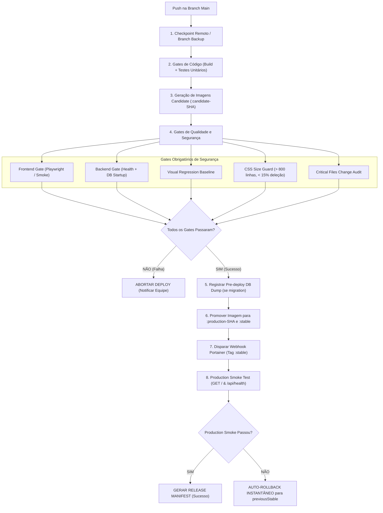

# RELEASE SAFETY & INSTANT ROLLBACK POLICY — WITIQUETAS

> **Documento Canônico de Operações e Segurança de Infraestrutura**  
> *Versão:* 1.0.0 — *Data de Vigência:* 21 de Agosto de 2026  
> *Regra Suprema:* **PUSH != DEPLOY**, **BUILD VERDE != PRODUÇÃO**, **LATEST PROIBIDO EM PRODUÇÃO**.

---

## 1. Princípios Fundamentais de Segurança

1. **Imutabilidade por SHA:** Nenhuma imagem ou container de produção deve utilizar a tag mutável `:latest`. Toda build gera artefatos identificados pelo SHA completo do commit Git (`backend:<FULL_SHA>` e `frontend:<FULL_SHA>`).
2. **Promotibilidade Candidate ➔ Stable:** As imagens construídas entram na fase de validação marcadas como `candidate-<SHORT_SHA>`. Apenas após a aprovação de **todos os gates automatizados** a imagem é promovida para `production-<FULL_SHA>` e a tag `stable` é atualizada.
3. **Rollback Instantâneo sem Rebuild:** Um rollback para a versão anterior (`previousStable`) **nunca exige recompilação de código**. As imagens das releases anteriores permanecem mantidas no GHCR e o rollback consiste no reapontamento atômico da tag `stable` e disparo de redeploy no Portainer.
4. **Proteção Automática de Banco de Dados:** Antes de qualquer implantação contendo migrações de banco de dados, um dump comprimido do PostgreSQL (`pg_dump`) é gerado automaticamente e armazenado no S3/MinIO.

---

## 2. Fluxo de Implantação e Gates de Segurança



---

## 3. Estrutura de Tags de Imagens no GHCR

| Ambiente / Fase | Formato da Tag | Mutabilidade | Descrição |
| :--- | :--- | :--- | :--- |
| **Build Candidate** | `ghcr.io/wittemberg/witiquetas-frontend:candidate-<SHORT_SHA>` | Imutável | Imagem gerada durante CI para execução de suítes de testes E2E. |
| **Produção SHA** | `ghcr.io/wittemberg/witiquetas-frontend:production-<FULL_SHA>` | Imutável | Imagem aprovada em todos os gates e pronta para audit/rollback. |
| **Produção Ativa** | `ghcr.io/wittemberg/witiquetas-frontend:stable` | Mutável (Ponteiro) | Tag referenciada pelo Portainer / Docker Swarm em produção. |

---

## 4. Política de Checkpoints e Retenção

### Checkpoints Locais e Remotos
- **Local (`.recovery/`):** Criado via `scripts/safety/create-checkpoint.ps1` antes de comitar ou alterar arquivos críticos. Guarda o manifesto `manifest.json`, diffs locais e tarball de untracked.
- **Remoto Automático (`backup/pre-push-YYYYMMDD-HHMMSS-<SHORT_SHA>`):** Branch criada no GitHub antes de todo push na `main`, salvaguardando o HEAD remoto exatamente antes das novas alterações.

### Retenção
- **Releases `stable` anteriores:** Mínimo de **10 releases imutáveis** mantidas no GHCR.
- **Checkpoints de homologação manual:** Não expiram.
- **Backups de Banco de Dados:** Retenção de 7 backups diários, 4 semanais e 3 mensais no MinIO/S3.

---

## 5. Rollback de Emergência e Incident Recovery

Em caso de qualquer anomalia em produção, execute o rollback em tempo **menor que 5 minutos**:

### Execução via PowerShell:
```powershell
.\scripts\release\rollback-production.ps1 -TargetSHA "previous"
```

### Execução via Bash / Linux:
```bash
./scripts/release/rollback-production.sh previous
```

O script identifica a release anterior registrada em `release-manifest.json`, reaponta a tag `stable` no GHCR para essa imagem imutável e aciona o webhook do Portainer para atualizar os serviços imediatamente.

---

## 6. Arquivos Críticos Monitorados (Critical File Guard)

Qualquer alteração nos seguintes arquivos dispara obrigatoriamente a suíte completa de regressão e auditoria visual:

- `apps/frontend/src/App.tsx`
- `apps/frontend/src/index.css`
- `apps/frontend/src/editor/EditorLayout.tsx`
- `apps/frontend/src/editor/CanvasArea.tsx`
- `apps/frontend/src/editor/PropertyInspector.tsx`
- `apps/frontend/src/editor/useEditorStore.ts`
- `apps/backend/src/index.ts`
- `packages/label-schema/src/index.ts`
