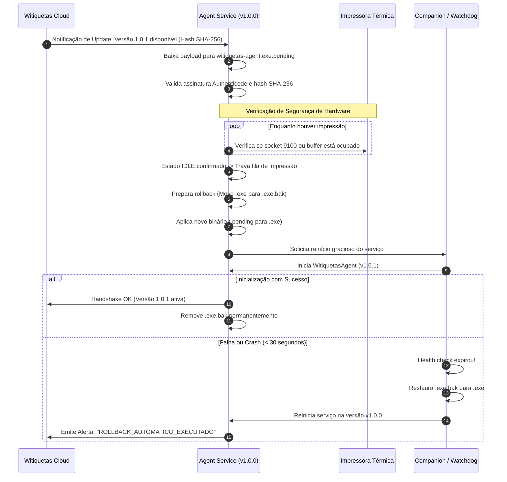

# Arquitetura de Atualização e Recuperação Automática (Auto-Update)
**Pesquisa e Especificação de Ciclo de Vida do Agent (Agent F)**  
*Status: DOCUMENTO CANÔNICO DE PESQUISA*  
*Data de Conclusão: Outubro de 2026*

---

## 1. Princípios Inegociáveis de Atualização

A atualização de um componente de hardware em produção é uma operação de alto risco. O Witiquetas Agent estabelece quatro regras invioláveis de engenharia:

1. **Nunca Interromper Impressão Física em Andamento:**  
   Se um lote de etiquetas ZPL/PPLB estiver sendo transmitido para o buffer da impressora térmica via RAW TCP (porta 9100) ou USB, a atualização é sumariamente adiada.
2. **Zero Janelas de Terminal:**  
   O processo de download, substituição de binários e reinicialização de serviço deve ser 100% invisível ao operador.
3. **Rollback Automático Determinístico:**  
   Se o novo binário sofrer crash, falhar na inicialização do serviço ou não conseguir se conectar à nuvem nos primeiros 30 segundos, o sistema restaura a versão anterior automaticamente sem intervenção humana.
4. **Validação Criptográfica de Origem:**  
   Somente binários assinados digitalmente e cujo hash SHA-256 coincida rigorosamente com o manifesto da nuvem são aplicados.

---

## 2. O Desafio de Bloqueio de Arquivo no Windows

No Microsoft Windows, o kernel bloqueia a exclusão ou sobrescrita direta de qualquer arquivo executável que esteja em execução (`ERROR_SHARING_VIOLATION` / Código de erro 32). Para contornar essa restrição sem exigir reinicialização do computador, adotamos a técnica de **Substituição Atômica em Três Fases**:

```
[Fase 1: Download]
  witiquetas-agent.exe (Executando normalmente - v1.0.0)
  witiquetas-agent.exe.pending (Novo binário v1.0.1 baixado e validado)

[Fase 2: Trava de Impressão & Swap Atômico]
  1. Service aguarda status IDLE (Nenhum job de impressão ativo)
  2. Adquire trava exclusiva de atualização (Bloqueia novos jobs)
  3. Para o serviço Windows (StopService - transição de < 2 segundos)
  4. Move witiquetas-agent.exe       --> witiquetas-agent.exe.bak
  5. Move witiquetas-agent.exe.pending --> witiquetas-agent.exe
  6. Inicia o serviço Windows (StartService)

[Fase 3: Health Check & Finalização]
  - Sucesso nos primeiros 30s: Exclui witiquetas-agent.exe.bak
  - Falha nos primeiros 30s: Reverte .bak para .exe e reinicia serviço anterior
```

---

## 3. Fluxo de Execução da Atualização



---

## 4. Estratégia de Liberação Gradual (Staged Rollout)

Para impedir que eventuais regressões afetem a operação de milhares de lojas simultaneamente, a plataforma Witiquetas adota distribuição por anéis de confiança:

1. **Anel 0 — Canary / Interno (0% a 5%):**  
   Ambientes de teste, lojas de validação e laboratórios homologados.
2. **Anel 1 — Early Adopters (15%):**  
   Empresas voluntárias configuradas para receber novidades antecipadamente.
3. **Anel 2 — Rollout Geral (50% a 100%):**  
   Liberação gradual ao longo de 72 horas para a totalidade dos clientes após validação dos índices de erro e telemetria nos anéis anteriores.
4. **Kill-Switch Imediato:**  
   A equipe de engenharia pode revogar qualquer versão no backend com um clique. Ao detectar a revogação no próximo ciclo de polling, os agentes que receberam o update executam o rollback imediatamente.

---

## 5. Governança e Configuração por Empresa (Tenant)

O comportamento de atualização respeita a soberania administrativa de cada cliente:
- **Modo Automático Recomendado (Padrão):** O Agent atualiza sozinho fora do horário de pico comercial (ex: entre 01:00 e 05:00 da manhã) quando o estado da impressora for `IDLE`.
- **Modo Gerenciado / TI Corporativo:** A empresa pode fixar a versão máxima suportada em sua política interna, permitindo que a equipe de TI homologue a atualização antes de autorizar o despacho para seus terminais.
