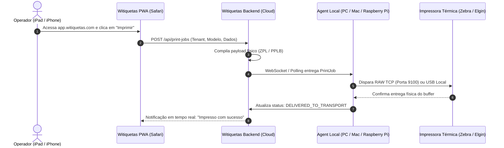

# Arquitetura e Compatibilidade Apple: macOS, iOS e iPadOS
**Pesquisa Técnica e Diretrizes Oficiais do Ecossistema Apple (Agent D)**  
*Status: DOCUMENTO CANÔNICO DE PESQUISA*  
*Data de Conclusão: Outubro de 2026*

---

## 1. Separação de Plataformas e Modelos Operacionais

O ecossistema Apple impõe restrições arquiteturais distintas entre seus sistemas operacionais de desktop/servidor (**macOS**) e seus sistemas móveis (**iOS / iPadOS**). Tentativas de tratar ambos de forma idêntica resultam em falhas de arquitetura e violações das diretrizes da Apple.

```
                      +-----------------------------+
                      |     ECOSSISTEMA APPLE       |
                      +-----------------------------+
                                     |
               +---------------------+---------------------+
               |                                           |
       [ macOS (Desktop) ]                        [ iOS / iPadOS (Mobile) ]
   - Arquitetura Unix aberta                   - Sandbox extrema e restritiva
   - Daemons em segundo plano                  - Proibição de daemons contínuos
   - Acesso a RAW TCP / USB                    - Fechamento de sockets em 30s
   - Fora da Mac App Store: VIÁVEL             - Fora da App Store: INVIÁVEL
   ==> AGENT NATIVO COMPLETO                   ==> OPERAÇÃO VIA WEB / PWA
```

---

## 2. macOS: O Agent Nativo fora da Mac App Store

### 2.1. Viabilidade Técnica
A distribuição de um Agent nativo para macOS fora da Mac App Store é **100% viável, homologada e recomendada pela própria Apple** para softwares de infraestrutura, desde que cumpridos os requisitos de assinatura e notarização.

### 2.2. Arquitetura de Binário e Compilação
- **Universal Binary 2:**  
  O binário é compilado de forma nativa para arquiteturas Intel (`x86_64-apple-darwin`) e Apple Silicon M1/M2/M3/M4 (`aarch64-apple-darwin`), unificados via ferramenta `lipo`:
  ```bash
  lipo -create -output target/universal/witiquetas-agent \
      target/x86_64-apple-darwin/release/witiquetas-agent \
      target/aarch64-apple-darwin/release/witiquetas-agent
  ```
- **Tamanho e Desempenho:** Binário universal único de aproximadamente 7.5 MB, com inicialização instantânea e consumo inferior a 15 MB de RAM.

### 2.3. Modelo de Execução: LaunchDaemon
Para operar como um serviço autônomo e contínuo que não depende de sessão de usuário aberta:
- **Local:** `/Library/LaunchDaemons/com.witiquetas.agent.plist`
- **Permissões:** Executado sob usuário de sistema ou root, garantindo acesso direto à rede local (RAW TCP 9100) e dispositivos USB sem prompts intrusivos de privacidade.
- **Configuração de Sobrevivência:**
  ```xml
  <?xml version="1.0" encoding="UTF-8"?>
  <!DOCTYPE plist PUBLIC "-//Apple//DTD PLIST 1.0//EN" "http://www.apple.com/DTDs/PropertyList-1.0.dtd">
  <plist version="1.0">
  <dict>
      <key>Label</key>
      <string>com.witiquetas.agent</string>
      <key>ProgramArguments</key>
      <array>
          <string>/usr/local/bin/witiquetas-agent</string>
          <string>--service</string>
      </array>
      <key>RunAtLoad</key>
      <true/>
      <key>KeepAlive</key>
      <true/>
      <key>StandardOutPath</key>
      <string>/var/log/witiquetas-agent.log</string>
      <key>StandardErrorPath</key>
      <string>/var/log/witiquetas-agent-err.log</string>
  </dict>
  </plist>
  ```

### 2.4. Assinatura e Notarização Apple (Gatekeeper)
Para instalar no macOS Sonoma, Sequoia e versões futuras sem bloqueio pelo Gatekeeper (*"O macOS não pôde verificar se o app está livre de malware"*):
1. **Developer ID Application:** O binário é assinado com a chave da organização registrada na Apple Developer.
2. **Hardened Runtime:** Ativação obrigatória da flag `--options runtime`.
3. **Developer ID Installer:** O pacote `.pkg` gerado é assinado com o certificado de instalador da organização.
4. **Submissão ao Notary Service:**
   ```bash
   xcrun notarytool submit witiquetas-agent-setup.pkg \
       --keychain-profile "WIT_NOTARY_PROFILE" --wait
   xcrun stapler staple witiquetas-agent-setup.pkg
   ```
Com o tíquete grampeado (`stapled`), a instalação ocorre com dois cliques no instalador gráfico padrão do macOS.

---

## 3. iOS e iPadOS: Limitações Reais da Apple

### 3.1. Por Que um Agent Não Pode Rodar no iOS?
Uma análise técnica minuciosa das diretrizes e da API do iOS/iPadOS revela impedimentos intransponíveis para a execução de um Agent de impressão no dispositivo móvel:

1. **Suspensão Agressiva de Background:**  
   O iOS suspende imediatamente qualquer processo em segundo plano após 30 segundos, a menos que o app se enquadre em categorias restritas (reprodução de áudio contínua, chamadas VoIP, navegação GPS por curva). O envio de jobs para impressoras térmicas não se enquadra nessas categorias e é sumariamente rejeitado na App Store.
2. **Fechamento de Sockets TCP:**  
   Conexões de rede persistentes (como o streaming de jobs ou polling) são finalizadas pelo kernel do iOS assim que a tela apaga ou o usuário muda de aplicativo.
3. **Ausência de Suporte a USB Genérico:**  
   Conectar uma impressora térmica USB diretamente a um iPad via adaptador Lightning ou USB-C exige que a impressora possua certificação oficial **MFi (Made for iPhone)** da Apple ou que o app utilize protocolos proprietários dos fabricantes (que não cobrem a diversidade de impressoras de mercado como Argox, Elgin e Zebra legadas).
4. **Rejeição nas Diretrizes da App Store:**  
   A Seção 2.5.4 das *App Store Review Guidelines* proíbe explicitamente aplicativos que atuem como serviços persistentes de terceiros em segundo plano.
5. **Alternativas Não Viáveis:**  
   Distribuição corporativa via *Apple Developer Enterprise Program* é restrita ao uso interno de funcionários e sofre risco iminente de revogação de certificado pela Apple, além de não eliminar o bloqueio de sockets em background.

---

## 4. A Arquitetura Recomendada: A Solução PWA

Para viabilizar que operadores utilizem iPhones e iPads no chão de fábrica, estoque ou salão de vendas **sem violar as políticas da Apple e sem depender de aprovação na App Store**, adota-se a arquitetura canônica de nuvem:



### Vantagens do Modelo PWA:
- **Zero Instalação:** O operador apenas clica em "Adicionar à Tela de Início" no Safari do iPad.
- **Independência de Aprovação:** Nenhuma dependência de aprovação da Apple na App Store.
- **Compatibilidade Total:** O iPad pode estar conectado em rede 4G/5G externa ou no Wi-Fi da loja; a impressão é despachada para a impressora correta através do Agent local pareado.
- **Segurança:** O dispositivo móvel não precisa de acesso direto à porta 9100 ou à VLAN restrita de hardware.
