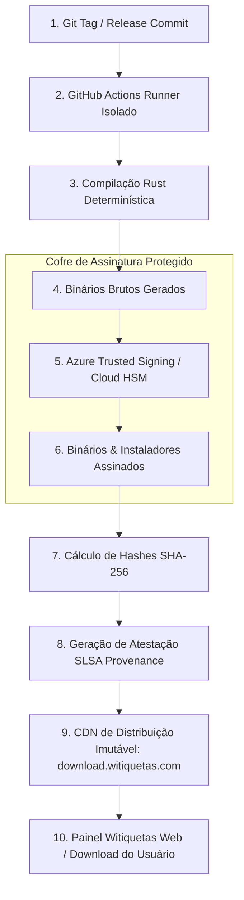

# Cadeia de Confiança, Assinatura e Segurança de Suprimentos
**Pesquisa e Especificação de Segurança e Distribuição (Agent E)**  
*Status: DOCUMENTO CANÔNICO DE PESQUISA*  
*Data de Conclusão: Outubro de 2026*

---

## 1. O Desafio de Reputação: Superando o Microsoft SmartScreen

Quando um operador de loja faz o download de um instalador `.exe` no Windows 10 ou 11 e o executa, o **Microsoft Defender SmartScreen** bloqueia a execução com a temida tela azul:
> *"O Windows protegeu o seu computador. O Microsoft Defender SmartScreen impediu a inicialização de um aplicativo não reconhecido."*

Para um usuário leigo, essa tela é sinônimo de vírus e interrompe imediatamente a adoção da plataforma. Superar essa barreira de forma profissional exige conformidade rigorosa com a cadeia de assinatura digital.

---

## 2. Estratégia de Assinatura por Plataforma

### 2.1. Windows Authenticode
- **Tipo de Certificado:** Certificado de Assinatura de Código por Organização (OV) ou Validação Estendida (EV).
- **Provedor Recomendado: Azure Trusted Signing (Microsoft Trusted Signing):**  
  A partir de 2024, a Microsoft disponibilizou um serviço de assinatura em nuvem integrado com o Azure Identity. Esse serviço elimina a necessidade de tokens USB físicos (FIPS 140-2 Level 2) para desenvolvedores, permite assinatura automatizada em pipelines de CI/CD e **acelera drasticamente o ganho de reputação no SmartScreen**, pois as assinaturas são atestadas diretamente pela própria infraestrutura de identidade da Microsoft.
- **Timestamping Obrigatório (RFC 3161):**  
  Todo binário e instalador é assinado com carimbo de tempo SHA-256 (`http://timestamp.digicert.com` ou servidor do Azure). Isso garante que, mesmo após a expiração da validade de 1 a 3 anos do certificado, o instalador continue válido e reconhecido pelo Windows indefinidamente.
- **Comando de Assinatura de Referência:**
  ```cmd
  signtool sign /fd SHA256 /tr http://timestamp.digicert.com /td SHA256 /sha1 <THUMBPRINT> WitiquetasAgentSetup.exe
  ```

### 2.2. macOS Developer ID e Notarização
- **Developer ID Application:** Utilizado para assinar os binários compilados (`witiquetas-agent` e `witiquetas-tray`).
- **Developer ID Installer:** Utilizado para assinar o pacote unificado de instalação (`witiquetas-agent.pkg`).
- **Hardened Runtime:** O binário é compilado com as proteções do Mach-O ativadas (`--options runtime`).
- **Notarização Apple:** Submissão automatizada via API do Notary Service (`xcrun notarytool`). Sem essa etapa, o Gatekeeper do macOS bloqueia a execução com aviso de perigo. O tíquete de aprovação é anexado permanentemente ao instalador (`xcrun stapler staple`).

### 2.3. Linux: Chaves GPG e Repositórios Seguros
- Os pacotes `.deb` e `.rpm` são assinados com chave privada GPG de 4096 bits da Witiquetas.
- Os repositórios APT e RPM publicam arquivos `Release.gpg` e `repodata/repomd.xml.asc`.
- Para downloads diretos via script ou tarball, disponibiliza-se o arquivo `SHA256SUMS` acompanhado de sua assinatura desanexada `SHA256SUMS.asc`.

---

## 3. Arquitetura da Cadeia de Suprimentos (Supply Chain)

Para assegurar conformidade com padrões corporativos modernos (SLSA Nível 3 / NIST SP 800-218), nenhum binário de produção é gerado na máquina local de desenvolvedores:



### Regras Estritas de Segurança de Pipeline:
1. **Zero Exposição de Segredos:** Nenhuma chave privada ou certificado é armazenado em variáveis de ambiente estáticas do repositório. A comunicação com o Azure Trusted Signing ocorre via autenticação federada OpenID Connect (OIDC) com privilégios temporários.
2. **Releases Imutáveis:** Cada release é atrelada a uma tag criptográfica imutável (ex: `v1.2.0`). Um arquivo uma vez publicado na CDN nunca é sobrescrito; atualizações exigem incrementos semânticos de versão (`v1.2.1`).
3. **Manifesto de Integridade (`manifest.json`):**  
   A plataforma web e o serviço de auto-atualização do Agent consomem um manifesto assinado contendo a lista oficial de artefatos:
   ```json
   {
     "version": "1.0.0",
     "releasedAt": "2026-10-06T12:00:00Z",
     "minSupportedVersion": "0.1.0",
     "artifacts": {
       "windows-x64-setup": {
         "filename": "WitiquetasAgentSetup-1.0.0-x64.exe",
         "sha256": "8a3f...d4e2",
         "size": 5242880,
         "url": "https://download.witiquetas.com/releases/1.0.0/WitiquetasAgentSetup-1.0.0-x64.exe"
       },
       "linux-x86_64-musl": {
         "filename": "witiquetas-agent-1.0.0-linux-x86_64.tar.gz",
         "sha256": "4b9c...a1f0",
         "size": 4194304,
         "url": "https://download.witiquetas.com/releases/1.0.0/witiquetas-agent-1.0.0-linux-x86_64.tar.gz"
       }
     }
   }
   ```
4. **Verificação Local pelo Agent:** Antes de aplicar qualquer atualização automática ou executar o instalador, o sistema valida obrigatoriamente se o hash SHA-256 do arquivo baixado coincide exatamente com o manifesto oficial.
