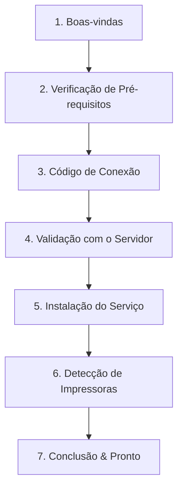

# Arquitetura do Instalador Windows & UX Zero-Terminal
**Pesquisa e Especificação de Engenharia de Distribuição (Agent B)**  
*Status: DOCUMENTO CANÔNICO DE PESQUISA*  
*Data de Conclusão: Outubro de 2026*

---

## 1. Comparativo Técnico de Tecnologias de Empacotamento

Para atender ao requisito de **Zero-Terminal UX**, o instalador não pode depender de comandos no CMD/PowerShell, frameworks de terceiros ou janelas de console piscando na tela do operador. Avaliamos 6 opções do ecossistema Windows:

| Tecnologia | Formato de Saída | Dependências em Tempo de Execução | Suporte a Windows Service | Customização do Wizard / UI | Instalação Silenciosa (TI) | Overhead de Tamanho | Veredito |
| :--- | :--- | :--- | :--- | :--- | :--- | :--- | :--- |
| **Inno Setup 6** | `.exe` único | **ZERO** (Puro Win32 nativo) | Excelente (APIs Win32 integradas) | Máxima (Scripting nativo em Pascal) | Nativo (`/VERYSILENT`, `/CODE=...`) | ~2.5 MB | **RECOMENDADO (Varejo / Padrão)** |
| **WiX Toolset v4/v5** | `.msi` / `.exe` | Windows Installer Engine (MSI) | Excelente (`<ServiceInstall>`) | Média/Difícil (Burn exige C++ ou .NET para UI rica) | Padrão da indústria (`msiexec /qn`) | ~3.0 MB | **RECOMENDADO (Corporativo / GPO)** |
| **NSIS** | `.exe` único | **ZERO** (Puro Win32) | Bom (via plugins de serviço) | Boa (scripts C-like complexos) | Nativo (`/S`) | ~1.8 MB | Alternativa viável, porém menos robusta que Inno |
| **MSIX** | `.msix` | App Installer / Win 10 2004+ | Péssimo (Serviços empacotados exigem permissões restritas) | Ruim (UI fixa da Microsoft Store) | Bom via PowerShell/MDM | ~5.0 MB | **REJEITADO** (Inadequado para drivers/serviços de spooler) |
| **Tauri Installer** | `.exe` | **WebView2 Runtime** (~150MB) | Requer wrapper externo | Excelente (HTML/CSS/JS) | Limitado | > 80 MB | **REJEITADO** (Dependência pesada e frágil em servidores) |
| **Custom Rust Win32** | `.exe` único | **ZERO** (Win32 / `windows-rs`) | Manual completo | Total | Manual | ~4.0 MB | Alto custo de reinventar ciclo de desinstalação |

---

## 2. Decisão de Tecnologia: A Solução Híbrida

Para atender tanto ao comerciante individual quanto a grandes redes com milhares de PDVs:

1. **Instalador Oficial de Varejo (`WitiquetasAgentSetup.exe`):**  
   Construído com **Inno Setup 6**. Um único executável, assinado digitalmente, com assistente visual em 7 etapas, máscara para código de pareamento, detecção automática de conectividade e zero consoles.
2. **Pacote Corporativo Silencioso (`WitiquetasAgent.msi`):**  
   Construído com **WiX Toolset v4**. Destinado exclusivamente a equipes de TI para distribuição via Active Directory GPO, Microsoft Intune, SCCM ou Ansible, aceitando parâmetros de pareamento via linha de comando (`PAIRCODE="WIT-XXXX-XXXX"`).

---

## 3. Topologia e Diretórios no Sistema de Arquivos

O instalador segue rigidamente as diretrizes de segurança da Microsoft (separação estrita entre código executável somente leitura e dados mutáveis de serviço):

```
C:\Program Files\Witiquetas\Agent\              <-- APENAS EXECUTÁVEIS (Acesso restrito: Administradores)
├── witiquetas-agent.exe                        <-- Binário Core (Windows Service & Engine)
├── witiquetas-tray.exe                         <-- Tray Companion (Aplicação de bandeja)
├── unins000.exe                                <-- Desinstalador nativo
└── LICENSE.txt

C:\ProgramData\Witiquetas\Agent\                <-- DADOS MUTÁVEIS (Acesso: NT AUTHORITY\SYSTEM + Admins)
├── config.json                                 <-- Configurações de polling, timeouts e rede
├── identity.json                               <-- Identidade única do Agent e chaves criptográficas de máquina
├── certs\                                      <-- Certificados mTLS de máquina (quando aplicável)
└── logs\                                       <-- Logs rotativos estruturados
    ├── witiquetas-agent.log
    └── witiquetas-agent.log.1
```

---

## 4. Gerenciamento do Windows Service (SCM)

O Agent é registrado diretamente no **Windows Service Control Manager (SCM)** sem depender do comando externo `sc.exe`:

- **Nome do Serviço (`ServiceName`):** `WitiquetasAgent`
- **Nome de Exibição (`DisplayName`):** `Witiquetas Print Agent`
- **Descrição:** `Serviço de segundo plano para processamento e despacho de impressões térmicas da plataforma Witiquetas.`
- **Tipo de Inicialização:** `SERVICE_AUTO_START` (com flag `SERVICE_CONFIG_DELAYED_AUTO_START_INFO` ativada para não desacelerar a inicialização inicial do Windows em PDVs lentos).
- **Conta de Execução:** `NT AUTHORITY\SYSTEM` (garante acesso direto a hardware de impressão USB local e comunicação de rede irrestrita em nível de máquina).
- **Ações de Recuperação Automática (`SERVICE_FAILURE_ACTIONS`):**
  - Primeira falha: Reiniciar o serviço após 5 segundos.
  - Segunda falha: Reiniciar o serviço após 15 segundos.
  - Falhas subsequentes: Reiniciar o serviço após 60 segundos.
  - Reset do contador de falhas: 86.400 segundos (24 horas).

---

## 5. O Fluxo Visual do Assistente Zero-Terminal

O instalador gráfico `WitiquetasAgentSetup.exe` foi projetado com uma experiência linear de 7 telas, garantindo que o operador nunca veja janelas pretas do CMD:



### Detalhamento das Telas do Assistente:

1. **Tela 1 — Boas-vindas:**  
   Apresentação clara da marca, explicação sucinta do objetivo ("Conecte suas impressoras de etiquetas à plataforma Witiquetas"). Botão de avanço rápido.
2. **Tela 2 — Verificação Automática do Computador (Diagnóstico Inicial):**  
   Executada em segundo plano em < 2 segundos com indicadores verdes:
   - [x] Conexão com a internet disponível;
   - [x] Acesso aos servidores do Witiquetas confirmado;
   - [x] Permissões de administrador verificadas.
3. **Tela 3 — Código de Pareamento:**  
   Campo de entrada estilizado com caixa alta automática e formatação em bloco: `WIT - [ 7K4P ] - [ 92MX ]`. Um botão "Colar da Área de Transferência" facilita o fluxo caso o operador tenha copiado o código da plataforma web.
4. **Tela 4 — Conexão com a Empresa:**  
   O instalador chama a API de handshake de pareamento:
   - Resposta imediata: *"Conectado com sucesso à empresa: Mercado Central Ltda"*;
   - Confirmação visual do nome sugerido para o computador ("PDV-01-FRENTE").
5. **Tela 5 — Instalação e Inicialização do Serviço:**  
   Cópia dos binários para `Program Files`, gravação da identidade em `ProgramData` e ativação imediata do Windows Service via chamadas da API Win32.
6. **Tela 6 — Descoberta de Impressoras Locais:**  
   O serviço inicia uma varredura local silenciosa (impressoras de rede na porta RAW 9100 e portas USB/Spooler locais), exibindo: *"Encontramos 2 impressoras: Zebra ZD220 (USB) e Elgin L42 Pro (192.168.1.150)"*.
7. **Tela 7 — Conclusão com Sucesso:**  
   Mensagem reconfortante: *"Tudo pronto! Seu computador está conectado. Você já pode emitir etiquetas pela plataforma web."* Opção marcada: *"Iniciar ícone na barra de tarefas ao ligar o computador"*.

---

## 6. Parâmetros de Instalação Silenciosa para Equipes de TI

Para implantações automatizadas em redes com centenas de terminais, o instalador suporta execução sem interface gráfica:

```powershell
# Instalação silenciosa básica com código de pareamento
WitiquetasAgentSetup.exe /VERYSILENT /SUPPRESSMSGBOXES /NORESTART /PAIRCODE="WIT-7K4P-92MX"

# Instalação corporativa customizada com nome do computador e backend específico
WitiquetasAgentSetup.exe /VERYSILENT /SUPPRESSMSGBOXES /NORESTART /PAIRCODE="WIT-7K4P-92MX" /AGENTNAME="PDV-CAIXA-04" /BACKENDURL="https://app.witiquetas.com"
```

### Tratamento de Códigos de Saída (`Exit Codes`):
- `0`: Sucesso na instalação e pareamento.
- `10`: Código de pareamento inválido ou expirado.
- `20`: Falha de conexão com os servidores Witiquetas (bloqueio de firewall/DNS).
- `30`: Falha ao criar ou iniciar o Windows Service no SCM.
- `40`: Instalação cancelada pelo usuário ou UAC rejeitado.

---

## 7. Desinstalação, Atualização e Reparo

- **Atualização sobre versão existente (Upgrade):**  
  O instalador detecta a versão anterior gravada no registro (`HKLM\Software\Witiquetas\Agent`). Durante o upgrade, ele **preserva intacto** o arquivo `identity.json` e a chave de pareamento, interrompe o serviço temporariamente, atualiza os binários e reinicia o serviço. O operador não precisa redigitar o código `WIT-XXXX-XXXX`.
- **Desinstalação Limpa (Uninstall):**  
  Executada pelo Painel de Controle ou Configurações do Windows. Para o serviço, remove o registro do SCM, apaga os atalhos e remove os arquivos de `Program Files`. Exibe um diálogo amigável: *"Deseja manter as configurações e o pareamento deste computador para uma futura reinstalação?"*. Caso o usuário selecione "Não", remove também `ProgramData\Witiquetas`.
- **Garantia Anti-Console:**  
  Todos os sub-processos e utilitários compilados utilizam o subsistema nativo do Windows (`/SUBSYSTEM:WINDOWS`), eliminando por completo a criação de consoles associados (`AllocConsole`), garantindo experiência 100% gráfica e silenciosa.
