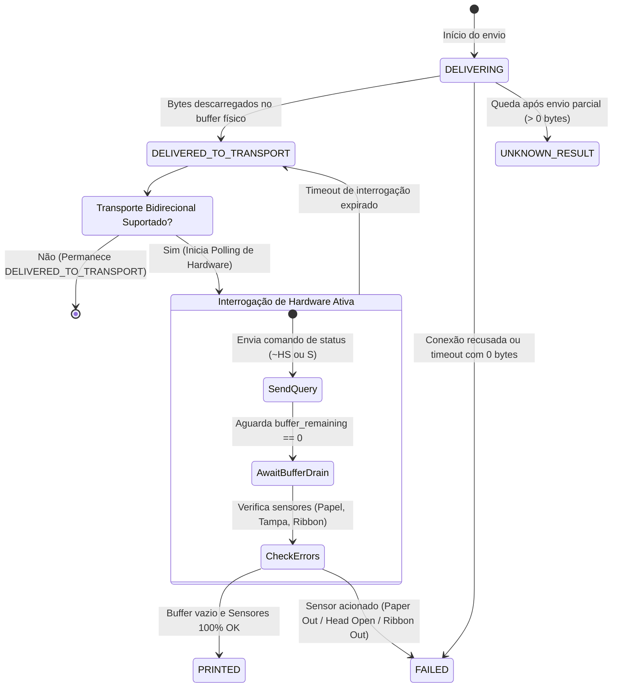

# WITIQUETAS — LOCAL AGENT FUTURE ARCHITECTURE
**Auditoria e Plano de Evolução Arquitetural do Agente Local de Impressão**  
**Componente:** Witiquetas Agent Core (`apps/agent-core`) & Protocolo Cloud (`apps/backend/src/routes/agents.ts`)  
**Trilha Paralela:** ROADMAP FORWARD PREPARATION  
**Data:** 14/09/2026  
**Status:** ANÁLISE ARQUITETURAL / NÃO-EXECUTÁVEL (Sem alteração de código)  
**Conformidade:** Alinhado a `DOCUMENTACAO-AGENTE-LOCAL.md`, `AGENTS.md`, `CONTEXT.md` e contratos canônicos `@witiquetas/contracts`.

---

## 1. AUDITORIA ARQUITETURAL DO AGENT CORE ATUAL

O **Witiquetas Agent Core** é o componente de execução física do ecossistema. Ele opera como daemon local instalado no ambiente do cliente, fazendo a ponte segura entre o backend em nuvem e as impressoras térmicas locais.

### 1.1 O Que Está Efetivamente Implementado no Código
| Subsistema | Arquivos de Código | Mecanismos Implementados |
| :--- | :--- | :--- |
| **Daemon & Ciclo de Vida** | `service.rs`, `main.rs` | Daemon assíncrono em Rust sobre Tokio. Integração nativa com Windows Service Control Manager (SCM) via `windows-service` v0.7. Comandos `--install-service`, `--uninstall-service`, `--service-status` e `--run-service`. Encerramento gracioso com `watch::channel`. |
| **Identidade e Pareamento** | `pairing.rs`, `identity.rs` | Pareamento com código de uso único (`WIT-XXXX-XXXX`). Persistência em `%ProgramData%\Witiquetas\Agent\identity.json`. Transição para estado `AUTH_REQUIRED` em resposta a HTTP 401/403. |
| **Protocolo & Polling** | `runtime.rs`, `client.rs` | Polling HTTP(S) com `reqwest` direcionado a rotas canônicas públicas (`/api/agents/heartbeat`, `/api/print-jobs/pending`). Backoff progressivo limitado (2s $\rightarrow$ 5s $\rightarrow$ 10s $\rightarrow$ 20s $\rightarrow$ 30s $\rightarrow$ 60s). |
| **Integridade de Payload** | `validator.rs` | Validação em 3 estágios: Base64 decoding $\rightarrow$ conferência do tamanho exato em bytes $\rightarrow$ verificação de hash SHA-256. |
| **Máquina de Entrega** | `runtime.rs` | Gates de estado: `CLAIMED` $\rightarrow$ `DOWNLOADED` $\rightarrow$ `DELIVERING` $\rightarrow$ `DELIVERED_TO_TRANSPORT`. Suporte a `CopyStrategy` (`EMBEDDED_IN_PAYLOAD` vs `TRANSPORT_REPEAT`). |
| **Roteamento de Transporte**| `transport/mod.rs`, `raw_tcp.rs`| `DynamicRouterTransport` com princípio *Fail-Closed* estrito. `RawTcpTransport` com timeouts de conexão (4s) e transmissão (5s), laço defensivo contra escritas parciais e flush explícito. |
| **Idempotência & Erros** | `runtime.rs`, `transport/mod.rs`| Deduplicação em memória via `processed_attempts` indexado por `job_id:attempt_id`. Erros com $>0$ bytes gravados transicionam para `UNKNOWN_RESULT` (prevenindo duplicação de etiquetas). |
| **Logging Sanitizado** | `logging.rs` | Rotação diária via `tracing-appender` gravando em `%ProgramData%\Witiquetas\Agent\logs\`. Filtro ativo de sanitização que mascara tokens `agt_live_...` e headers de autorização. |

---

### 1.2 O Que Está Ausente no Agent Core Atual
1. **Comunicação USB Direta:** Sem abstração de endpoints USB Bulk OUT/IN.
2. **Serial RS-232 / Portas COM:** O protocolo define `serial_port` e `baud_rate`, mas o roteador rejeita como `InvalidTarget`.
3. **Spooler do Windows (`winspool.drv`):** Inexistência de chamadas à API Win32 (`OpenPrinter`, `WritePrinter`).
4. **Descoberta de Impressoras na Rede Local (Printer Discovery):** Inexistência de varredura mDNS, SNMP ou SSDP. Cadastro depende de IP manual.
5. **Enumeração de Hardware Local:** Não enumera impressoras instaladas no SO nem portas seriais/adaptadores USB-Serial.
6. **Reporte de Capacidades & Telemetria Estendida:** Não envia `memoryUsageMb`, `uptimeSeconds`, `transportHealth`.
7. **Feedback de Hardware (Canal Bidirecional):** Envio TCP atual é 100% *write-only*, sem leitura de status físico (ex: falta de papel, tampa aberta).
8. **Fila Local Persistente Offline:** Jobs vivem em memória RAM; queda de energia durante o processamento perde o job.
9. **Auto-Atualização Assinada:** Inexistência de rotina de download e conferência de assinatura Authenticode.

---

## 2. EVOLUÇÃO DA ESTEIRA: CLOUD → AGENT → PRINTER

```
┌────────────────────────────────────────────────────────────────────────┐
│                        DynamicRouterTransport                          │
└──────────────┬───────────────────┬───────────────────┬─────────────────┘
               │                   │                   │                  
               ▼                   ▼                   ▼                  
      ┌─────────────────┐ ┌─────────────────┐ ┌─────────────────┐         
      │  RawTcpTransport│ │ WinSpoolTransport│ │ SerialTransport │         
      │  (Port 9100/9200)│ │ (Raw Datatype)  │ │ (RS-232 / COM)  │         
      └────────┬────────┘ └────────┬────────┘ └────────┬────────┘         
               │                   │                   │                  
               ▼                   ▼                   ▼                  
      ┌─────────────────┐ ┌─────────────────┐ ┌─────────────────┐         
      │  Socket2 TCP    │ │ Win32 Spooler   │ │ tokio-serial    │         
      │  Keep-Alive +   │ │ OpenPrinterW /  │ │ Baud/Data/Parity│         
      │  TCP_NODELAY    │ │ WritePrinter    │ │ Hardware Flow   │         
      └─────────────────┘ └─────────────────┘ └─────────────────┘         
```

### 2.1 Protocolos de Transporte Físico

#### A. RAW TCP (Rede Ethernet / Wi-Fi)
- **Parâmetros de Baixo Nível (`socket2`):**
  - `TCP_NODELAY = true`: Desabilita algoritmo de Nagle, eliminando latências de 40ms a 200ms em comandos térmicos.
  - `SO_KEEPALIVE`: Intervalo agressivo (idle 10s, probe 2s, 3 repetições) para detectar impressoras desligadas no meio do turno.
  - `SO_LINGER`: Tempo finito de 2s a 3s para garantir que pacotes saiam da pilha antes do encerramento com `FIN/RST`.
- **Diretriz de Conexão: Sob Demanda com Timeout Curto.**
  - Impressoras térmicas possuem placas de rede simples com suporte a **apenas 1 conexão TCP simultânea na porta 9100**. Manter sockets persistentes abertos pelo Agent bloqueia outros sistemas (ex: ERP desktop) e trava a placa de rede da impressora.
  - O socket deve ser aberto, os dados transmitidos com flush e a conexão fechada imediatamente.

#### B. USB: Spooler do Windows (WinSpool RAW) vs WinUSB Direto
| Critério | WinUSB / libusb Direto | Spooler do Windows (`winspool.drv` RAW) |
| :--- | :--- | :--- |
| **Convivência com Drivers** | **Crítica.** O driver do fabricante (`usbprint.sys`) bloqueia WinUSB. Trocar driver via Zadig quebra outros softwares. | **Excelente.** Utiliza o driver instalado pelo cliente ou o driver genérico (`Generic / Text Only`). |
| **Complexidade no Cliente** | Alta. Exige instalação de driver INF e permissões especiais. | Nula. Conecta a qualquer impressora visível no painel do Windows. |
| **Envio de Bytes Compilados**| Bulk OUT direto. | Suportado nativamente com `pDocInfo.pDataType = "RAW"` via `StartDocPrinterW`. Os bytes não sofrem conversão gráfica. |
| **Decisão Arquitetural** | Secundário (ambientes industriais controlados). | **Caminho Primário e Padrão para USB no Windows.** |

#### C. Serial RS-232 (Crate `tokio-serial`)
- Configuração canônica: 9600 a 115200 bps, 8-N-1.
- **Controle de Fluxo por Hardware (RTS/CTS): MANDATÓRIO.** Buffers seriais térmicos possuem entre 2KB e 8KB. Transmissões sem controle de fluxo estouram o buffer em milissegundos.
- **Controle de Fluxo por Software (XON/XOFF — 0x11/0x13): PROIBIDO.** Se um byte de imagem ou código de barras coincidir com `0x11` ou `0x13`, a impressora pausa a recepção indefinidamente.

---

### 2.2 Descoberta Autônoma de Impressoras (Printer Discovery)
Para eliminar configuração manual de IPs em campo, o Agente incorporará 4 varreduras:
1. **mDNS / Bonjour:** Busca por serviços nos domínios `_pdl-datastream._tcp.local` (porta 9100) e `_printer._tcp.local` (porta 515). Extrai fabricante, modelo e linguagem dos registros TXT.
2. **SNMP v1/v2c:** Consulta a portas UDP 161 nos OIDs:
   - `sysDescr.0` (`1.3.6.1.2.1.1.1.0`): Identificação de marca, modelo e firmware.
   - `hrPrinterStatus` (`1.3.6.1.2.1.25.3.5.1.1.1`): Estado operacional (idle, printing, error).
   - `hrPrinterDetectedErrorState` (`1.3.6.1.2.1.25.3.5.1.2.1`): Bits de falha física (lowPaper, noPaper, doorOpen, jammed).
3. **Win32 Spooler API:** Invocação de `EnumPrintersW` para listar filas de impressão locais e portas USB virtuais (`USB001`, `IP_...`).
4. **Registro do Windows (Portas Seriais):** Varredura em `HKLM\HARDWARE\DEVICEMAP\SERIALCOMM` para detectar portas COM físicas e adaptadores USB-Serial (FTDI, CH340, Prolific).

---

### 2.3 Telemetria e Capabilities
O Agente passará a emitir o DTO canônico `AgentCapabilitiesReportDTO` em 3 situações:
- Handshake inicial de boot;
- Notificação de evento Plug & Play (`WM_DEVICECHANGE`);
- Solicitação explícita do backend (`mustReportCapabilities: true` no heartbeat).

Métricas de telemetria no heartbeat: `uptimeSeconds`, `memoryUsageMb` (prevenção de memory leaks), `activeJobsCount`, `printersCount` e `transportHealth` (latência média de socket).

---

## 3. ESTADO DO TRANSPORTE VS FEEDBACK DA IMPRESSORA

```
┌────────────────────────────────────────────────────────────────────────────────────────┐
│               PRESERVAÇÃO INEGOCIÁVEL DA INVARIANTE ARQUITETURAL                       │
│                                                                                        │
│                   DELIVERED_TO_TRANSPORT  !=  PRINTED                                  │
│                                                                                        │
│  "A confirmação de entrega de bytes ao transporte atesta apenas que os dados           │
│   foram recebidos pelo buffer do canal. Não atesta a queima térmica dos pontos,        │
│   a tração mecânica da mídia nem a integridade física da etiqueta."                    │
└────────────────────────────────────────────────────────────────────────────────────────┘
```

### 3.1 Limites Físicos de Detecção
| Transporte | O que é FISICAMENTE DETECTÁVEL | O que NÃO é detectável |
| :--- | :--- | :--- |
| **RAW TCP Unidirecional (9100)** | Conexão aceita pelo print server; entrega dos bytes à pilha TCP; encerramento de conexão. | **Nada além do buffer de rede.** Não detecta falta de papel, cabeça aberta, falta de ribbon ou travamento pós-recepção. |
| **RAW TCP com Consulta Bidirecional** | Buffer esvaziado; etiquetas restantes no buffer; cabeça aberta (`Head Open`); falta de papel (`Paper Out`); erro de ribbon. | Descolamento manual da etiqueta pelo operador (salvo sensor peel-off); defeito mecânico na cabeça térmica que gere etiqueta em branco. |
| **Windows Spooler RAW (`winspool.drv`)** | Criação do Job na fila do Windows; transmissão para a porta USB; encerramento do spooler. | Se a porta USB for unidirecional, o Spooler deleta o job da fila assim que os bytes deixam a RAM do PC, mesmo sem papel na impressora. |
| **Serial RS-232 com RTS/CTS** | Prontidão mecânica para receber dados; respostas a comandos interrogativos (`<ESC>S`, `~HS`). | Queima real dos pontos térmicos; etiqueta presa após o rolo mecânico de tração. |

---

### 3.2 Máquina de Confirmação em Duas Fases (Two-Phase Physical Completion)



1. **Fase 1 (Obrigatória):** O Agente transmite o payload compilado. Ao receber confirmação de flush do socket ou driver, transiciona para `DELIVERED_TO_TRANSPORT`.
2. **Fase 2 (Condicional e Assíncrona):**
   - Se a impressora e o transporte suportarem canal de retorno:
     - O Agente envia comando de consulta imediata de hardware (`~HS` para ZPL, `<ESC>S` para PPLA/PPLB, `<ESC>!?` para TSPL).
     - Se `buffer_remaining == 0` e sensores indicarem OK: emite patch para `PRINTED`.
     - Se sensores indicarem falha mecânica (`PAPER_OUT`, `RIBBON_OUT`, `HEAD_OPEN`): emite patch para `FAILED` com a falha diagnosticada.
     - Se o hardware não responder no timeout (ex: 5s): **mantém `DELIVERED_TO_TRANSPORT`**. Na dúvida, jamais presume `PRINTED`.

---

## 4. RESILIÊNCIA, FAIL-SAFE E ATUALIZAÇÃO SEGURA

### 4.1 Tratamento de Queda de Rede Durante Transmissão (PartialWrite)
- Se a escrita cair após transmitir $>0$ bytes: **classificação imperativa como `UNKNOWN_RESULT`**.
- **PROIBIÇÃO DE RETRY AUTOMÁTICO:** Nem o backend nem o Agente podem reenviar automaticamente um job em `UNKNOWN_RESULT`. A reexecução automática poderia imprimir centenas de etiquetas duplicadas no chão de fábrica. Exige decisão visual do operador na Central de Impressão.

### 4.2 Tripla Barreira contra Duplicação de Etiquetas
1. **Attempt ID Único por Tentativa:** O backend gera um identificador único de tentativa física (`attempt_id`).
2. **Deduplicação no Agente:** O Agente rejeita jobs cujo par `job_id:attempt_id` já conste em sua tabela interna `processed_attempts`.
3. **Imutabilidade Terminal:** Jobs em `DELIVERED_TO_TRANSPORT` ou `PRINTED` são imutáveis para aquela tentativa. Reimpressões criam obrigatoriamente um novo `attempt_id`.

### 4.3 Atualização de Binários Assinados (Signed Authenticode Updates)
- O Agente é estritamente cliente de saída (*Outbound-Only*); não abre portas HTTP/TCP no host do cliente.
- O executável de atualização (`witiquetas-agent-windows-x64.exe`) deve ser assinado digitalmente com certificado de Code Signing.
- Pipeline de Atualização:
  1. Download do pacote temporário para `%ProgramData%\Witiquetas\Agent\updates\`.
  2. Validação estrita do checksum SHA-256 contra o manifesto emitido pela API.
  3. Verificação de assinatura Authenticode via Win32 Trust API (`WinVerifyTrust` com `WINTRUST_ACTION_GENERIC_VERIFY_V2`).
  4. Se a assinatura for inválida, o binário é expurgado imediatamente e a atualização cancelada.
  5. Se aprovado, processo updater leve substitui o executável do serviço e reinicia o daemon.
